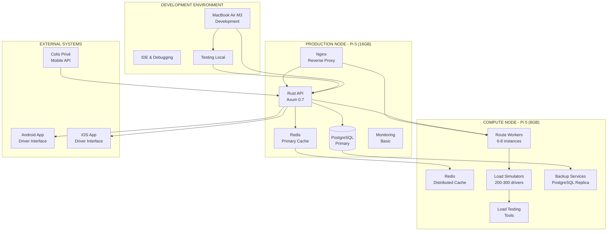

# 🏗️ ARQUITECTURA OPTIMIZADA - SETUP 2 PI

## 📋 **RESUMEN EJECUTIVO**

**Arquitectura:** Distribuida con 2 Raspberry Pi 5 + MacBook Air M3  
**Objetivo:** Sistema de enrutamiento de repartidores con capacidades distribuidas realistas  
**Estado:** 🟢 ARQUITECTURA DEFINIDA - LISTA PARA IMPLEMENTACIÓN

---

## 🖥️ **DIAGRAMA DE ARQUITECTURA**



---

## 🎯 **DISTRIBUCIÓN DE SERVICIOS**

### **1. MACBOOK AIR M3 - DESARROLLO**
```yaml
Rol: Development Environment
RAM: 8GB
Storage: 256GB SSD
OS: macOS Sonoma

Servicios:
  - Hot-reload development
  - Unit & integration testing
  - Advanced debugging
  - Rapid prototyping
  - Documentation & design
  - Git repository management
  - IDE (VS Code/Cursor)
  - Docker Desktop

Performance:
  - Compilation: ~2-3x faster than Pi
  - Testing: Parallel execution
  - Debugging: Full IDE support
```

### **2. RASPBERRY PI 5 (16GB) - MASTER NODE**
```yaml
Rol: Production & Primary Services
RAM: 16GB LPDDR4X
Storage: 128GB microSD + 1TB SSD
OS: Raspberry Pi OS 64-bit
CPU: Broadcom BCM2712 (4x Cortex-A76)

Servicios:
  - Rust API Server (Axum 0.7)
  - PostgreSQL Primary Database
  - Redis Primary Cache
  - Nginx Reverse Proxy
  - Basic Monitoring (Prometheus)
  - SSL/TLS Termination
  - Rate Limiting
  - Health Checks

Performance Esperada:
  - API Requests/sec: 800-1000
  - Concurrent Connections: 500
  - Database Queries/sec: 2000+
  - Cache Hit Rate: 95%+
  - RAM Available: ~12GB for services
```

### **3. RASPBERRY PI 5 (8GB) - COMPUTE NODE**
```yaml
Rol: Compute & Optimization Workers
RAM: 8GB LPDDR4X
Storage: 128GB microSD + 500GB SSD
OS: Raspberry Pi OS 64-bit
CPU: Broadcom BCM2712 (4x Cortex-A76)

Servicios:
  - Route Optimization Workers (6-8 instances)
  - Redis Distributed Cache
  - Load Simulators (200-300 drivers)
  - Backup Services (PostgreSQL Replica)
  - Load Testing Tools
  - Performance Monitoring
  - Failover Services

Performance Esperada:
  - Parallel Calculations: 6-8 workers
  - Simulation Capacity: 200-300 drivers
  - Cache Operations/sec: 1500+
  - RAM Available: ~6GB for workers
```

---

## 🔄 **FLUJO DE DATOS**

### **1. FLUJO PRINCIPAL (API REQUESTS)**
```
Client Request → Nginx → Rust API → PostgreSQL/Redis → Response
```

### **2. FLUJO DE OPTIMIZACIÓN**
```
Route Request → API → Worker Pool → Compute Node → Results → Cache → Response
```

### **3. FLUJO DE CACHE DISTRIBUIDO**
```
Request → Redis Primary → Redis Distributed → Worker Cache → Response
```

### **4. FLUJO DE BACKUP**
```
PostgreSQL Primary → Replication → Compute Node → Backup Storage
```

---

## 🛠️ **TECNOLOGÍAS IMPLEMENTADAS**

### **BACKEND (Rust)**
- **Framework:** Axum 0.7
- **Database:** SQLx + PostgreSQL
- **Cache:** Redis + Redis Cluster
- **Async Runtime:** Tokio
- **Serialization:** Serde
- **Logging:** Tracing + Tracing-subscriber

### **CONTAINERIZACIÓN**
- **Runtime:** Docker
- **Orchestration:** Docker Compose
- **Registry:** Local Registry
- **Networking:** Custom Bridge Networks

### **DATABASE & CACHE**
- **Primary DB:** PostgreSQL 15
- **Cache Layer:** Redis 7
- **Replication:** Master-Slave
- **Backup:** Automated with cron

### **LOAD BALANCING & PROXY**
- **Reverse Proxy:** Nginx
- **Load Balancing:** Round-robin
- **Health Checks:** Custom endpoints
- **SSL/TLS:** Let's Encrypt

---

## 📊 **MÉTRICAS DE PERFORMANCE**

### **THROUGHPUT TOTAL**
- **Combined Requests/sec:** 1200-1500
- **API Response Time:** <100ms (95th percentile)
- **Database Query Time:** <50ms (95th percentile)
- **Cache Hit Rate:** 95%+

### **CAPACIDAD DE OPTIMIZACIÓN**
- **Parallel Workers:** 8-12
- **Simulated Drivers:** 300-500
- **Route Calculations/sec:** 50-100
- **Memory Usage:** 70-80% of available

### **DISPONIBILIDAD**
- **Uptime Target:** 99%+
- **Failover Time:** <30 seconds
- **Backup Frequency:** Every 6 hours
- **Recovery Time:** <5 minutes

---

## 🔧 **CONFIGURACIÓN DE RED**

### **NETWORK TOPOLOGY**
```
Internet
    ↓
Router (192.168.1.1)
    ↓
    ├── MacBook M3 (192.168.1.100)
    ├── Pi 5 Master (192.168.1.101)
    └── Pi 5 Compute (192.168.1.102)
```

### **PORTS EXPUESTOS**
```yaml
Pi 5 Master (192.168.1.101):
  - 80: HTTP (Nginx)
  - 443: HTTPS (Nginx)
  - 3000: Rust API
  - 5432: PostgreSQL
  - 6379: Redis
  - 9090: Prometheus

Pi 5 Compute (192.168.1.102):
  - 3001: Worker API
  - 6380: Redis Distributed
  - 5433: PostgreSQL Replica
  - 9091: Worker Metrics
```

### **FIREWALL RULES**
```bash
# Pi 5 Master
ufw allow 80/tcp
ufw allow 443/tcp
ufw allow 3000/tcp
ufw allow from 192.168.1.102

# Pi 5 Compute
ufw allow 3001/tcp
ufw allow from 192.168.1.101
```

---

## 🚀 **DEPLOYMENT STRATEGY**

### **FASE 1: MVP MONOLÍTICO (Esta semana)**
```yaml
Estado: 🟢 EN PROGRESO
Objetivo: App Android funcionando con API
Servicios: Todo en Pi 5 (16GB)
Testing: MacBook M3
```

### **FASE 2: DISTRIBUCIÓN BÁSICA (Próxima semana)**
```yaml
Estado: 📋 PLANIFICADO
Objetivo: Servicios distribuidos entre 2 Pi
Docker: Implementado en ambos Pi
Redis: Cluster distribuido
Load Balancer: Nginx básico
```

### **FASE 3: OPTIMIZACIÓN (Semana 3)**
```yaml
Estado: 📋 PLANIFICADO
Objetivo: Monitoring y métricas avanzadas
Prometheus: Métricas completas
Grafana: Dashboards
Alerting: Notificaciones automáticas
```

### **FASE 4: PORTFOLIO (Semana 4)**
```yaml
Estado: 📋 PLANIFICADO
Objetivo: Documentación completa
Arquitectura: Diagramas detallados
Performance: Métricas documentadas
Presentación: Material técnico
```

---

## 🔍 **MONITORING & OBSERVABILIDAD**

### **MÉTRICAS CLAVE (KPIs)**
- **API Response Time:** <100ms
- **Database Performance:** <50ms queries
- **Cache Hit Rate:** >95%
- **System Uptime:** >99%
- **Memory Usage:** <80%
- **CPU Usage:** <70%

### **HERRAMIENTAS DE MONITORING**
- **Metrics Collection:** Prometheus
- **Visualization:** Grafana
- **Logging:** Structured logging with tracing
- **Health Checks:** Custom endpoints
- **Alerting:** Prometheus Alertmanager

### **DASHBOARDS PLANIFICADOS**
- **System Overview:** CPU, RAM, Disk, Network
- **API Performance:** Response times, throughput, errors
- **Database Metrics:** Query performance, connections
- **Cache Performance:** Hit rates, memory usage
- **Worker Status:** Active workers, queue length

---

## 🛡️ **SEGURIDAD & BACKUP**

### **SEGURIDAD IMPLEMENTADA**
- **SSL/TLS:** Let's Encrypt certificates
- **Firewall:** UFW rules
- **Rate Limiting:** Nginx + custom logic
- **Input Validation:** Rust type safety
- **SQL Injection Protection:** SQLx prepared statements

### **ESTRATEGIA DE BACKUP**
- **Database:** Automated PostgreSQL dumps
- **Configuration:** Git repository
- **Logs:** Rotated and archived
- **Recovery:** Documented procedures
- **Testing:** Monthly backup restoration tests

---

## 📈 **ESCALABILIDAD FUTURA**

### **ESCALABILIDAD HORIZONTAL**
- **Additional Compute Nodes:** Easy Pi 5 addition
- **Database Scaling:** Read replicas
- **Cache Scaling:** Redis cluster expansion
- **Load Balancing:** Multiple Nginx instances

### **ESCALABILIDAD VERTICAL**
- **Pi 5 Upgrades:** 16GB → 32GB (future)
- **Storage Expansion:** SSD upgrades
- **Network:** Gigabit → 2.5GbE (future)

---

## 🎯 **PRÓXIMOS PASOS INMEDIATOS**

1. **✅ Completar MVP monolítico** (Esta semana)
2. **📋 Preparar Docker setup** para ambos Pi
3. **📋 Configurar networking** entre nodos
4. **📋 Implementar Redis cluster** distribuido
5. **📋 Setup monitoring básico** con Prometheus

---

*Documento creado: 18 de Agosto, 2025*  
*Estado: 🟢 ARQUITECTURA COMPLETA*  
*Próximo milestone: MVP Monolítico funcionando*

